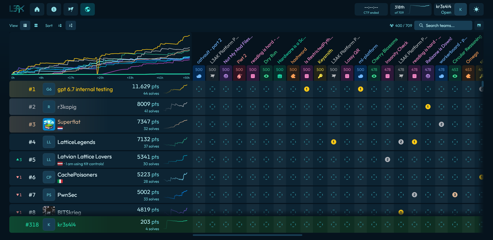

# 🎯 L3akCTF 2026

| Dato | Información |
|------|-------------|
| **Fecha** | 1 de julio - 2 de agosto de 2026 |
| **Modalidad** | Online |
| **Organiza** | L3akCTF |
| **Equipo** | kr3s4l4 (Captain) |
| **Puesto** | #318 de 709 |
| **Puntuación** | 203 pts |

## 🚩 Retos Resueltos

| Reto | Categoría | Puntos | Técnica | Writeup |
|------|-----------|--------|---------|---------|
| Sanity Check | Beginner | 1 | Lectura de reglas del torneo | [Ver](writeups/Sanity_Check/README.md) |
| Get The Flag | Web | 65 | Method override + CSRF bypass, cambio de contraseña de admin | [Ver](writeups/Get_The_Flag/README.md) |
| CatVault - Part 1 | Web | 62 | Inyección SQL (UNION SELECT), manipulación de sesión vía API | [Ver](writeups/catvault-part1/README.md) |
| Zebda | Web | 75 | Bypass de parsers YAML (js-yaml vs PyYAML), ofuscación Unicode | [Ver](writeups/Zebda/README.md) |

## 🛠️ Técnicas Utilizadas

| Categoría | Técnicas |
|-----------|----------|
| Web - SQLi | Inyección SQL con UNION SELECT, bypass de autenticación, MULTI_STATEMENTS |
| Web - CSRF | Method override (`_method=GET`), bypass de protección CSRF, cambio de contraseña |
| Web - YAML | Desync entre parsers (js-yaml 4.x vs PyYAML), merge keys (`<<`), ofuscación Unicode (ſ) |
| Beginner | Lectura de reglas, fundamentos de CTF |

## 📊 Resumen por Categoría

| Categoría | Retos | Puntos |
|-----------|-------|--------|
| Beginner | 1 | 1 |
| Web | 3 | 202 |
| **Total** | **4** | **200** |

## 📈 Progreso Temporal

| Día | Hora | Reto | Puntos |
|-----|------|------|--------|
| 1 ago | --:-- | Sanity Check | 1 |
| 1 ago | --:-- | Get The Flag | 65 |
| 1 ago | --:-- | Zebda | 75 |
| 2 ago | --:-- | CatVault - Part 1 | 62 |

## 🛠️ Herramientas Utilizadas

| Herramienta | Uso |
|-------------|-----|
| Python + requests | Scripting de exploits |
| SQLMap | Análisis de inyección SQL |
| Burp Suite | Análisis de peticiones HTTP |
| curl | Peticiones HTTP manuales |
| jq | Procesamiento de respuestas JSON |

## 📸 Capturas

## 📂 Writeups

- [Sanity Check](writeups/Sanity_Check/README.md)
- [Get The Flag](writeups/Get_The_Flag/README.md)
- [Zebda](writeups/Zebda/README.md)
- [CatVault - Part 1](writeups/catvault-part1/README.md)
